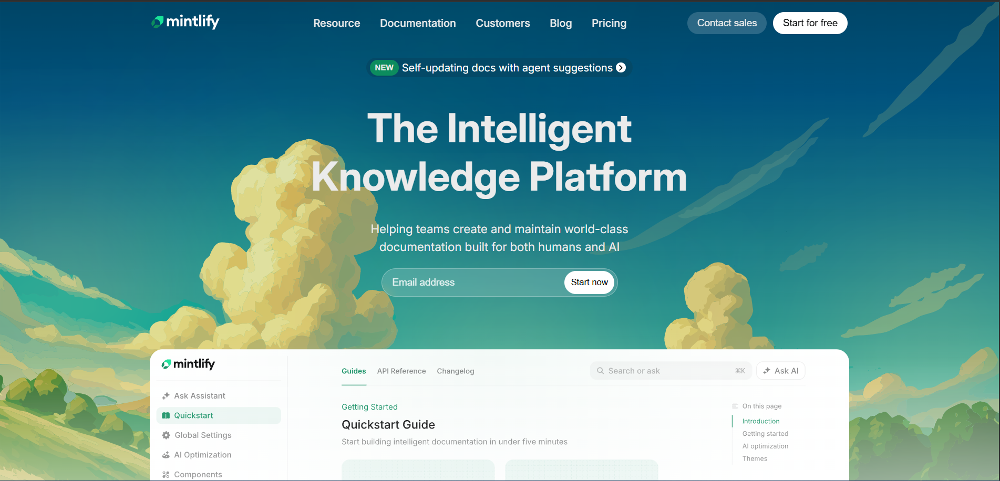
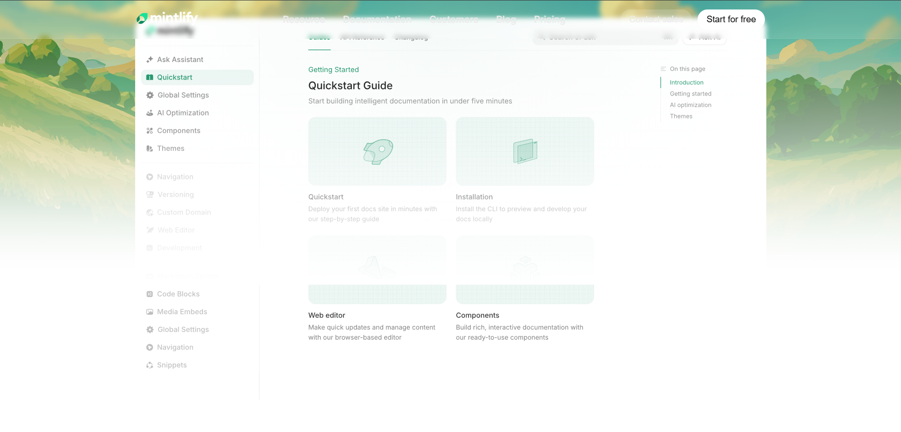
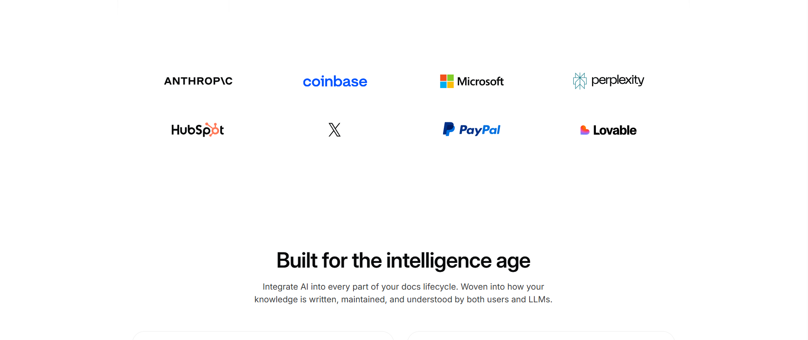
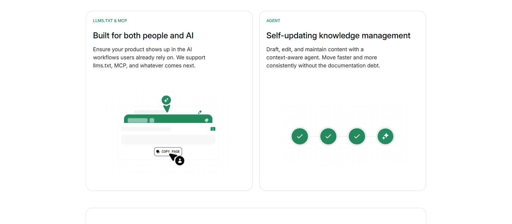
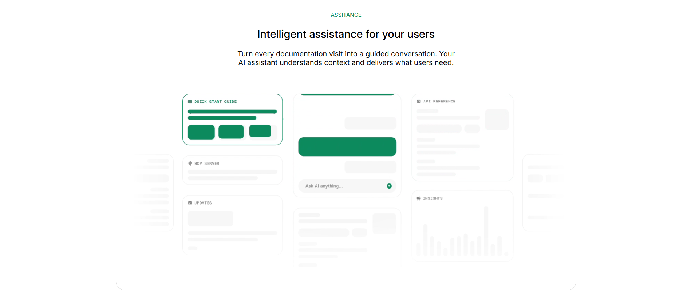
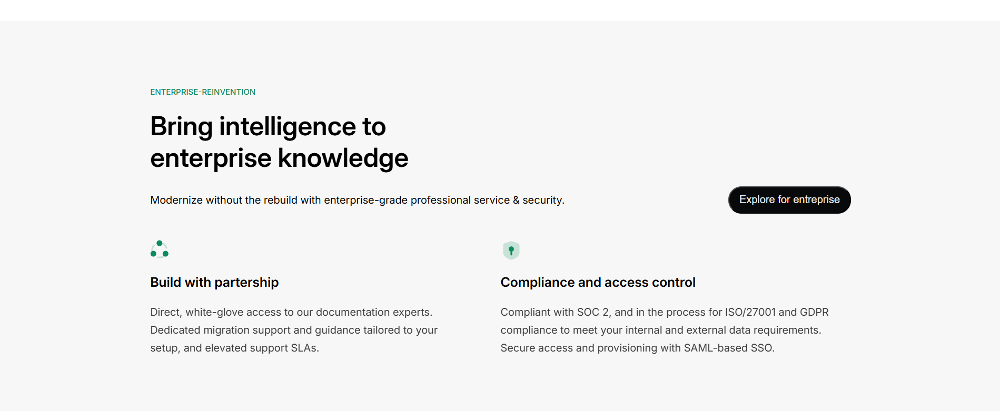
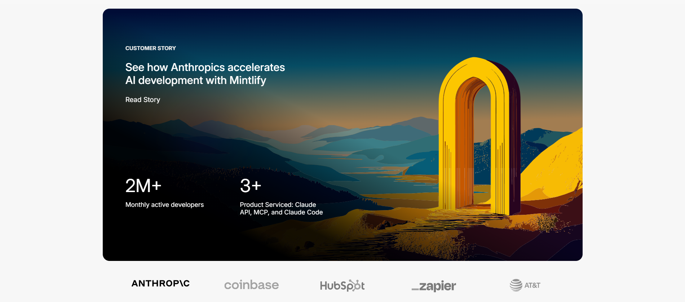
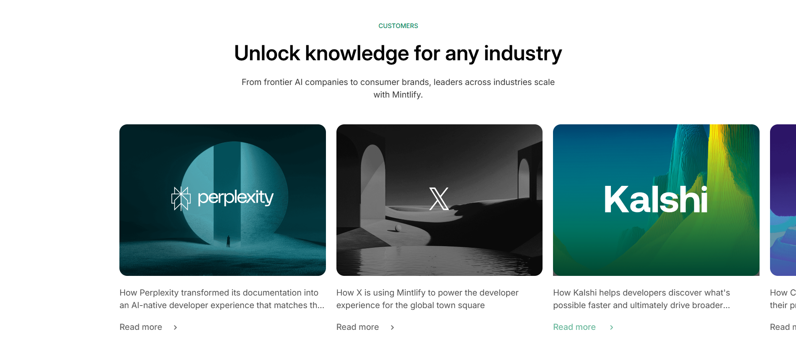
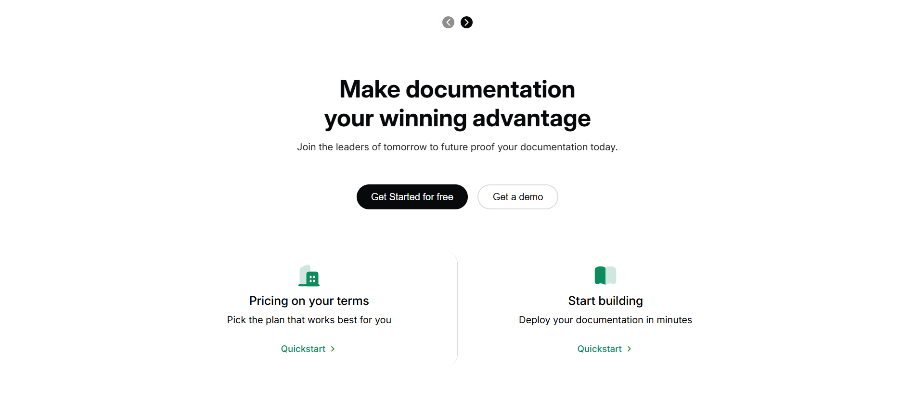
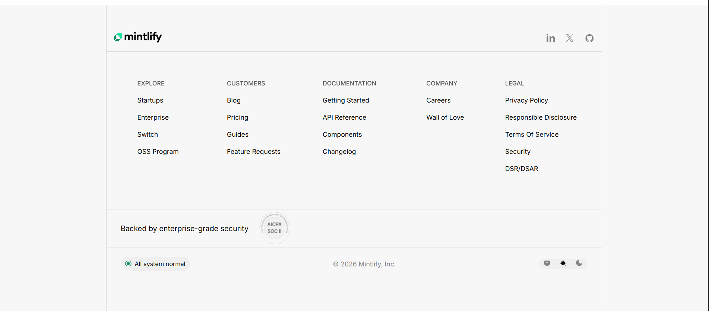

# Documentation website clone - mintlify

🔗 **Live Demo:** [View Live Website](https://mintlify-clone-xi.vercel.app/)

This project is a **static desktop-only clone of a modern SaaS landing page**, built using **pure HTML and CSS**.  
The goal was to closely replicate the **layout, visuals, typography, and structure** of the original website while strictly following defined constraints.

---

## 🎥 Project Demo

<video src="./video-ss/mintlify.mp4" controls width="100%" height="100%"></video>

---

## 🧩 Sections Implemented

### 1. Top Navigation Bar
- Company logo
- Navigation links
- Primary Call-To-Action (CTA)
- Implemented using semantic `<nav>` inside `<header>`

---

### 2. Hero Section
- Main headline
- Short description
- Email input field with CTA button
- Large background illustration

---

### 3. Documentation Preview Section
- Static sidebar-style navigation
- Main content cards layout
- Dashboard-style visual hierarchy

---

### 4. Trusted By / Logos Section
- Horizontal row of company logos
- SVGs and logos extracted using browser inspect tools
- Careful alignment and spacing

---

### 5. Feature Highlights
- Two-column layout (text + visual)
- Clear content hierarchy
- Clean, readable structure

---

### 6. Intelligent Assistant / UI Preview
- Large UI mockup image
- Supporting descriptive content
- Product feature showcase section

---

### 7. Enterprise Features Section
- Title with short introduction
- Feature blocks covering:
  - Security
  - Compliance
  - Reliability

---

### 8. Case Studies / Customer Stories
- Card-based layout
- Images with short descriptions
- Consistent card dimensions

---

### 9. Final Call-To-Action
- Strong heading
- Prominent CTA buttons
- Visually separated section

---

### 10. Footer
- Multi-column layout
- Company, product, and legal links
- Semantic `<footer>` usage

---

## 🛠️ Tech Stack

- HTML5
- CSS3

---
## 🎨 Design System (Light Theme)

### Color Palette

<table>
  <thead>
    <tr>
      <th align="left">Token</th>
      <th align="left">Hex</th>
      <th align="left">Usage</th>
    </tr>
  </thead>
  <tbody>
    <tr>
      <td><code>--white</code></td>
      <td><code>#ebebeb</code></td>
      <td>Primary background</td>
    </tr>
    <tr>
      <td><code>--white-hover</code></td>
      <td><code>#d9e4ea</code></td>
      <td>Hover states / subtle highlights</td>
    </tr>
    <tr>
      <td><code>--white-secondary</code></td>
      <td><code>#f7f7f7</code></td>
      <td>Secondary surfaces</td>
    </tr>
    <tr>
      <td><code>--black</code></td>
      <td><code>#08090a</code></td>
      <td>Primary text</td>
    </tr>
    <tr>
      <td><code>--green</code></td>
      <td><code>#0c8c5e</code></td>
      <td>Primary accent / success actions</td>
    </tr>
    <tr>
      <td><code>--border</code></td>
      <td><code>gainsboro</code></td>
      <td>Borders & separators</td>
    </tr>
  </tbody>
</table>

---

### 🔤 Typography

<table>
  <thead>
    <tr>
      <th align="left">Font</th>
      <th align="left">Weight Range</th>
      <th align="left">Usage</th>
    </tr>
  </thead>
  <tbody>
    <tr>
      <td><strong>Inter</strong></td>
      <td>100 – 900 (Italic supported)</td>
      <td>Primary UI, headings, body text</td>
    </tr>
    <tr>
      <td><strong>System Sans-Serif</strong></td>
      <td>Fallback</td>
      <td>Font fallback support</td>
    </tr>
  </tbody>
</table>

---

> This light theme focuses on **clarity, readability, and accessibility**,  
> using soft neutrals with a green accent for primary interactions.

---

### Screenshots












## ✅ Best Practices Followed

- Proper use of **semantic HTML tags**
- Fonts matched using **Google Fonts**
- SVGs, icons, and images collected via **browser inspect tools**
- Layout and spacing matched closely to the original design
- Clean, readable, and maintainable CSS

---

## 🚫 Constraints Followed

- ❌ No JavaScript
- ❌ No Tailwind CSS
- ❌ No animations or fancy effects
- ❌ No AI-generated assets
- ❌ No responsiveness (desktop-only)
- ✅ Only HTML and CSS used

---

## 🎯 Project Objective

This project focuses on:
- Practicing real-world layout implementation
- Improving semantic HTML usage
- Strengthening CSS fundamentals
- Understanding professional design structure

---

## 🚀 Run Locally (Clone & Test)

Follow these steps to run the project on your system:

```bash
git clone https://github.com/abhishek-2k23/Cohort26/tree/main/documentation-website-mitlify