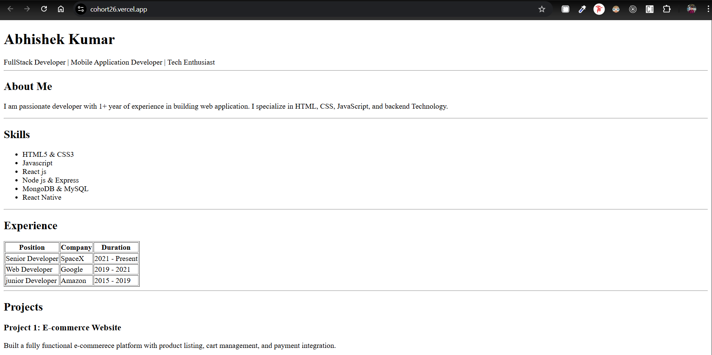

# Resume Website (HTML Assignment)

This project is a **simple resume website** created using **only HTML**.  
It demonstrates basic HTML concepts and semantic structure to build a personal resume webpage.

---

🔗 Live URL:
https://cohort26.vercel.app/

---

## Features

- Built using **HTML5 only**
- Clean and semantic structure
- Sections for About, Skills, Experience, Projects, Education, and Contact
- Tables used for Experience and Education
- Beginner-friendly assignment project

---

## Technologies Used

- **HTML5**

---

## 📂 Project Structure

resume-website/
│
├── index.html
├── README.md
└── screenshots/
└── resume-preview.png

---

## 🚀 Setup Steps (How to Run Locally)

1. Clone the repository or download the ZIP file  
   ```bash
   git clone <repository-url>

2. Navigate to the project folder
    ```bash
        cd Cohort26/resume-assignment

3. Open the project

    * Double-click index.html

✅ No installation or server required.

---

Screenshot

| Part 1 | Part 2 |
|-------------|----------------|
|  |  |


